# PLM Extensions Settings Update Process

This document describes the process to update the `/sandbox` branch of the PLM Extensions repository, make changes to settings files, and merge them to the `main` branch through a Pull Request.

## Process Overview

1. Update the sandbox branch
2. Get the repository locally
3. Make settings changes
4. Push changes to sandbox
5. Create Pull Request to main

## Detailed Steps

### 1. Update Sandbox Branch (on GitHub)

1. Go to [PLM Extensions Repository](https://github.com/hawa-it/plm-extensions)
2. Switch to the `sandbox` branch
3. Click on "Sync fork" button
4. Click "Update branch" to get latest changes from upstream
5. Compare /settings.js with /settings/settings_hawa.js and synchronize manually the 2 files. There may be new lines as well as deleted lines. Each difference must be analyzed and synchronized accordingly.

### 2. Get Repository Locally

```bash
# Clone the repository if not already done
git clone https://github.com/hawa-it/plm-extensions.git

# If already cloned, update your local repository
git checkout sandbox
git pull origin sandbox
```

### 3. Make Settings Changes

1. Navigate to the settings directory
2. Open `settings_hawa.js` in your preferred editor
3. Make the necessary modifications


### 4. Push Changes to Sandbox

```bash
# Add your changes
git add settings/hawa_settings.js

# Commit your changes with a meaningful message
git commit -m "Update HAWA settings: [brief description of changes]"

# Push to sandbox branch
git push origin sandbox
```

1. This push will trigger the deployment of the new code in the sandbox environment. Check Deployment on Github
2. Once deployed, test your changes
3. If ok, then merge into branch /main as described below (through a pull request)

### 5. Create Pull Request (on GitHub)

1. Go to [PLM Extensions Repository](https://github.com/hawa-it/plm-extensions)
2. Click on "Pull requests"
3. Click "New Pull Request"
4. Set:
   - Base branch: `main`
   - Compare branch: `sandbox`
5. Add title and description explaining your changes
6. Wait for tests to complete
7. If tests pass, request review and merge to main
8. If tests fail, make necessary corrections and push again to sandbox

## Important Notes

- Always test changes thoroughly in sandbox before creating a PR
- Ensure all tests pass before merging to main
- Document your changes clearly in the PR description
- Wait for approvals before merging

## Process Flow Diagram

```mermaid
graph TD
    A["Update sandbox branch<br/>on GitHub"] -->|"Sync fork"| B["Clone/Pull repo<br/>locally"]
    B --> C["Modify<br/>hawa_settings.js"]
    C --> D["Test changes<br/>locally"]
    D -->|"If tests pass"| E["Commit & Push<br/>to sandbox"]
    E --> F["Create PR:<br/>sandbox → main"]
    F --> G["Run tests"]
    G -->|"Tests pass"| H["Merge PR"]
    G -->|"Tests fail"| C
``` 

